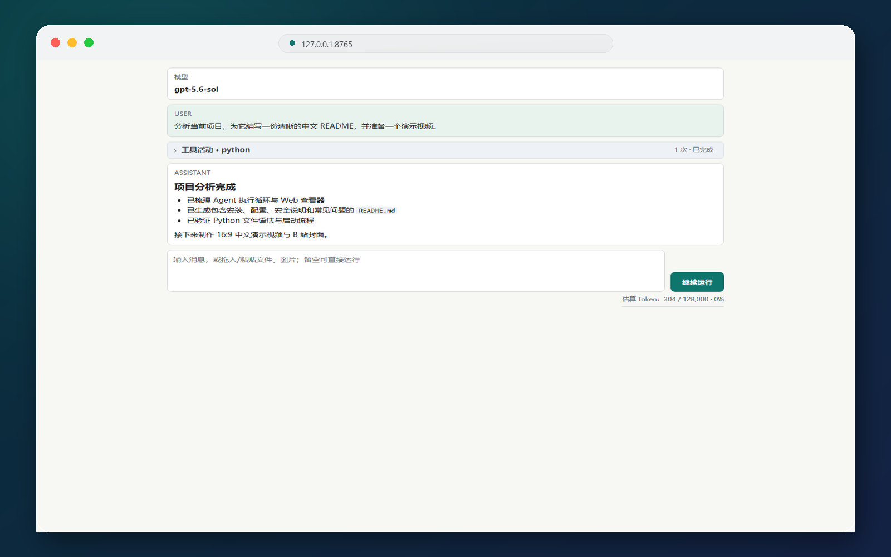
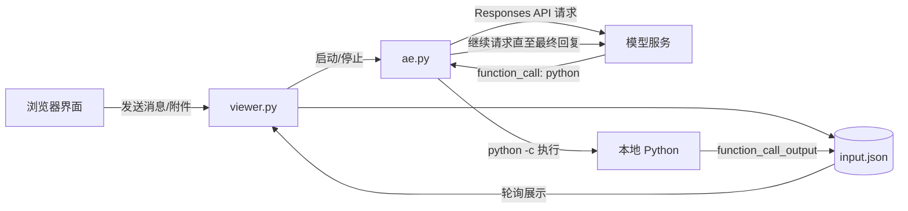

<div align="center">

# AI Exec

**一个极简、透明、可本地查看执行过程的 Python AI Agent 运行器**

让支持 **Responses API** 与 **Function Calling** 的模型直接调用 Python，读取文件、运行命令并完成多步骤任务；浏览器界面会实时展示消息、工具调用、运行状态与上下文占用。


</div>

> [!CAUTION]
> AI Exec 会执行模型生成的任意 Python 代码，并继承当前 Windows 用户的文件、网络和进程权限。它**不是沙箱**。请只连接可信的 API 服务与模型，不要处理来源不明的提示词或附件，也不要在存有重要凭据的环境中直接运行。

## 界面预览



## 特性

- **极简 Agent 循环**：请求模型 → 执行 Python 工具 → 回传结果 → 继续请求，直到模型给出最终答复。
- **过程完全可见**：在本地 Web 页面查看用户消息、模型回复、工具状态和完整工具输出。
- **文件与图片输入**：支持选择、拖入或粘贴附件；图片以多模态输入发送，文本文件直接转为文本内容。
- **运行控制**：可继续执行、发送新任务，也可通过按钮或 `Esc` 停止当前进程树。
- **轻量依赖**：核心执行器仅依赖 `requests`，界面服务使用 Python 标准库实现。
- **Windows 友好**：双击 `view.vbs` 即可后台启动，执行过程中不会反复弹出终端窗口。
- **上下文提示**：显示估算 Token 用量，并可通过环境变量调整上下文上限。

## 工作原理



`input.json` 同时承担配置与会话记录的角色。`ae.py` 每轮读取它，请求模型，把模型输出追加回文件；遇到 `function_call` 时执行其中的 Python 代码，再把标准输出作为 `function_call_output` 写回。

## 快速开始

### 1. 获取项目

```bash
git clone https://github.com/dongyudadiguo/ai_exec.git
cd ai_exec
```

也可以直接下载仓库 ZIP 并解压。

### 2. 安装 Python 与依赖

建议使用 **Python 3.10 或更高版本**：

```bash
python --version
python -m pip install requests
```

Windows 下也可以运行仓库中的 `depen_python_requests.bat` 安装 `requests`。如果系统尚未识别 `python` 命令，请先从 [python.org](https://www.python.org/downloads/) 安装 Python，并在安装时勾选 **Add Python to PATH**。

### 3. 配置 API

打开 `input.json`，至少修改以下三项：

```json
{
  "url": "https://YOUR_ENDPOINT/v1/responses",
  "headers": {
    "Authorization": "Bearer YOUR_API_KEY",
    "Content-Type": "application/json"
  },
  "json": {
    "model": "YOUR_MODEL"
  }
}
```

| 字段 | 说明 |
| --- | --- |
| `url` | 支持 Responses API 的完整请求地址 |
| `headers.Authorization` | API 密钥或服务商要求的认证信息 |
| `json.model` | 服务商支持的模型名称 |
| `json.reasoning.effort` | 推理强度；是否支持及可选值取决于服务商 |
| `json.instructions` | Agent 的系统指令 |
| `json.tools` | 暴露给模型的工具定义；默认仅提供 `python` |
| `json.input` | 会话历史，由界面与执行器持续追加 |

> [!IMPORTANT]
> `input.json` 已被 Git 跟踪。填入真实密钥后，切勿执行 `git add input.json` 或把它提交、截图、分享。已泄露的密钥应立即在服务商后台撤销并重新生成。

### 4. 启动

#### Windows（推荐）

双击：

```text
view.vbs
```

程序会在后台启动本地服务，并自动打开浏览器。

#### 命令行

```bash
python viewer.py
```

默认地址为 <http://127.0.0.1:8765>。如果端口已占用，程序会自动尝试后续端口。

### 5. 开始使用

1. 在输入框中描述任务；
2. 可选择、拖入或粘贴文件与图片；
3. 按 `Enter` 或点击按钮发送并运行；
4. 展开“工具活动”查看执行结果；
5. 运行中点击红色停止按钮，或按 `Esc`，可终止当前任务。

快捷操作：

| 操作 | 效果 |
| --- | --- |
| `Enter` | 发送并运行 |
| `Shift + Enter` | 输入换行 |
| `Esc` | 停止当前运行 |
| 留空后点击“继续运行” | 不追加消息，直接基于当前历史继续 |

## 配置项

启动前可通过环境变量调整界面行为：

| 环境变量 | 默认值 | 作用 |
| --- | ---: | --- |
| `AE_VIEWER_PORT` | `8765` | 本地 Web 服务起始端口 |
| `AE_TOOL_PREVIEW` | `800` | 工具输出在消息流中的预览字符数 |
| `AE_CONTEXT_LIMIT` | `128000` | Token 进度条使用的上下文上限 |

PowerShell 示例：

```powershell
$env:AE_VIEWER_PORT = "9000"
$env:AE_CONTEXT_LIMIT = "200000"
python viewer.py
```

## 项目结构

```text
ai_exec/
├─ ae.py                         # Agent 主循环与 Python 工具执行
├─ viewer.py                     # 本地 Web UI、状态轮询、附件和进程控制
├─ input.json                    # API 配置与会话历史
├─ view.vbs                      # Windows 无终端窗口启动入口
├─ depen_python_requests.bat     # 安装 requests
├─ depen_python.bat              # 检查/调用 python 命令
├─ noconsole_site/
│  └─ sitecustomize.py           # 隐藏工具子进程的控制台窗口
└─ skills/
   └─ find-skills/               # 可供 Agent 读取的技能说明
```

## API 兼容要求

该项目使用的是 **Responses API**，不是 Chat Completions API。服务端需满足以下基本约定：

1. 接受 `input.json` 中 `json` 对象作为请求体；
2. 返回 JSON，且顶层包含 `output` 数组；
3. 工具调用项使用 `type: "function_call"`，并提供 `call_id`、`name`、`arguments`；
4. 工具结果以 `type: "function_call_output"` 和同一 `call_id` 回传；
5. `arguments` 应为 JSON 字符串，其中包含 `code` 字段。

最小工具调用参数示例：

```json
{
  "code": "print('hello from AI Exec')"
}
```

## 安全建议

- 在虚拟机、Windows Sandbox 或权限受限的专用账号中运行高风险任务；
- 不要在项目目录或环境变量中存放云密钥、钱包私钥、浏览器 Cookie 等敏感信息；
- 运行前备份重要文件，并优先使用受版本控制的工作目录；
- 不要把服务监听地址改为公网地址；当前默认仅监听 `127.0.0.1`；
- 定期清理 `input.json`：其中可能包含提示词、附件内容、图片 Base64 与工具输出；
- 注意当前实现没有命令审批、权限隔离、调用预算和网络访问限制。

## 常见问题

<details>
<summary><strong>提示 <code>ModuleNotFoundError: No module named 'requests'</code></strong></summary>

执行：

```bash
python -m pip install requests
```

</details>

<details>
<summary><strong>浏览器没有自动打开</strong></summary>

手动访问 <http://127.0.0.1:8765>。若该端口被占用，请查看命令行输出中的实际地址，或设置 `AE_VIEWER_PORT`。

</details>

<details>
<summary><strong>接口返回 401 / 403</strong></summary>

检查 `input.json` 中的请求地址、`Authorization` 格式、密钥权限和账户余额。不同服务商的请求头可能不同，请以服务商文档为准。

</details>

<details>
<summary><strong>模型不调用 Python 工具</strong></summary>

确认所选模型支持 Function Calling / Tool Calling，并检查 `json.tools` 是否保留了 `python` 工具定义。也可以在 `json.instructions` 中更明确地要求模型主动使用工具。

</details>

<details>
<summary><strong>会话越来越大或接近上下文上限</strong></summary>

备份后清理 `json.input` 中不再需要的历史记录，再开始新任务。界面中的 Token 数字是轻量估算值，并非服务商的精确计费数据。

</details>

## 开发与调试

```bash
# 检查语法
python -m py_compile ae.py viewer.py noconsole_site/sitecustomize.py

# 在前台启动，便于查看日志
python viewer.py
```

建议提交前确认 `input.json` 不含真实密钥、私人对话、附件或工具输出。

## 当前限制

- Python 工具直接在宿主机执行，没有沙箱与人工审批；
- 会话记录保存在单个 JSON 文件中，不适合多用户并发；
- API 请求暂未设置超时、重试与流式输出；
- Token 用量为本地估算；
- 二进制非图片附件会转为 Base64 文本，可能快速占用上下文。

---

如果这个项目对你有帮助，欢迎提交 Issue、改进建议或 Pull Request。
